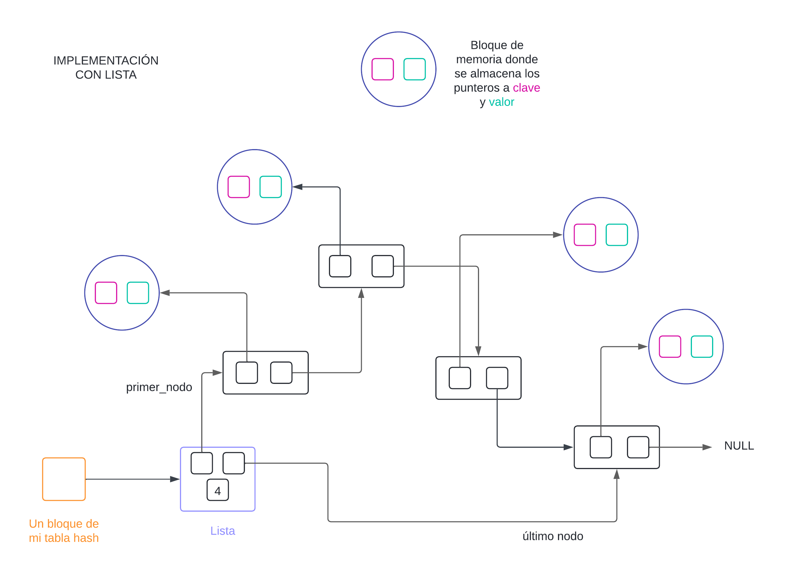
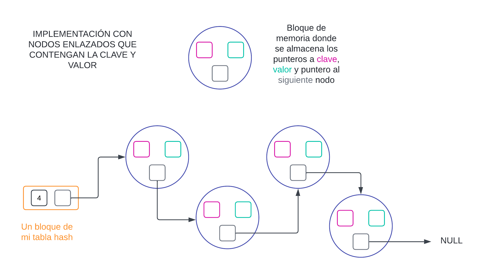
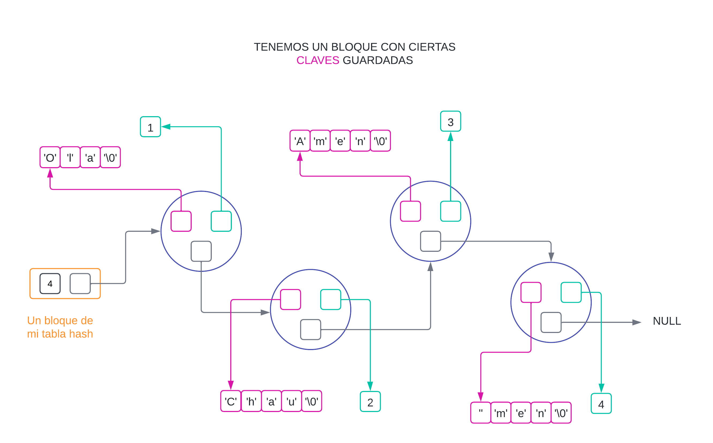

<div align="right">

</div>

# TDA HASH

## Repositorio de (Juan Ernesto Juarez Lezama) - (110418) - (jjuarez@gmail.com)

- Para compilar:

```bash
gcc -g tp_hash.c src/hash.c src/csv.c src/split.c -o tp_hash
```

- Para ejecutar:

```bash
./tp_hash pokedex.csv
```

- Para ejecutar con valgrind:
```bash
valgrind ./tp_hash pokedex.csv
```
---
##  Funcionamiento

Explicación de cómo funcionan las estructuras desarrolladas en el TP y el funcionamiento general del mismo.

<div align="center">

</div>


```c
int *vector = realloc(vector_original, (n+1)*sizeof(int));

if(vector == NULL)
    return -1;
vector_original = vector;
```


# IMPLEMENTACIÓN TDA HASH

## ESTRUCTURA
- Para mi implementación decidí utilizar nodos enlazados y no el TDA Lista, debido a que, aunque ambos tiene el concepto de ser nodos enlazados, estaría duplicando la cantidad de memoria que necesitaría. De nada me sirve crear nodos para guardar estructuras `clave - valor`, si mi nodo puede ser esa `clave - valor` y una referencia al siguiente nodo. Otra razón fundamental es, que si mi tabla depende de Listas, si una Lista falla al crearse, todo el hash tendría que detenerse y eso no me conviene al momento de redimensionar.

1) Listas 

<div align="center">

</div>

2) Nodos Enlazados 

<div align="center">

</div>

- Mis estructuras para este TDA son las siguientes:

```c
typedef struct nodo_par {
	char *clave;
	void *valor;
	struct nodo_par *siguiente;
} nodo_par_t;

typedef struct bloque {
	size_t cantidad_pares;
	nodo_par_t* nodo_inicio;
} bloque_t;

struct hash {
	bloque_t* tabla_hash;
	size_t capacidad_tabla_hash;
	size_t cantidad_pares_totales;
};
```

- Como estructura principal, tendremos un bloque que administra la cantidad de pares totales, la capacidad (tamaño) de mi tabla de hash y para mi caso en particular, decidí que cada bloque del vector contenga un indice de conteo para saber cuántos nodos tenemos enlazados en cada bloque y un puntero al inicio del recorrido de los nodos enlazados (Si no hay ningún nodo en algún bloque, ontonces hay `cantidad_pares` es `0` y `nodo_inicio` apunta a `NULL` en dicho bloque).

## FUNCION HASH

- Para explicar un poco cómo funciona mi implementación, primero explicar como funciona mi función hash
```c
size_t funcion_hash(const char *clave)
{
	size_t valor_hash = 2166136261U;
	size_t factor_primo = 16777619U;
	for (size_t i = 0; clave[i] != '\0'; i++) {
        valor_hash ^= (size_t)clave[i];
        valor_hash *= factor_primo;
	}
	return valor_hash;
}
```

- La función de hash que elgí es el algoritmo `FNV-1a`  
- Enlace: https://en.wikipedia.org/wiki/Fowler%E2%80%93Noll%E2%80%93Vo_hash_function#FNV-1a_hash
- Lo que hace este algoritmo es tener 2 variables, un número llamado `valor_hash` que es un número base (valor inicial) donde vamos a contener el hasheo final, y otra variable `factor_primo` que, como su nombre indica, es un número primo, esto es así porque se demuestra que los números primos manejan mejor el factor de mezclar las cosas, mejor dicho, el hasheo tiende a ser diferente clave tras clave y eso ayuda a la dispersión de las claves, lo que significa que no habrá tantas colisiones.  
El operador `^=` es un `XOR`. Ya que cada caracter es un valor numerico en la tabla ASCII, cada valor numerico se puede manejar como binario, entonces se aplica `XOR` entre el binario de `valor_hash` y el binario de del ASCII de cada caracter de la clave y luego el valor en decimal se multiplica con el número primo. Y así hasta iterar todos los caracteres de la clave.


## BUSQUEDA DE CLAVES

- Como vamos a trabajar con nodos enlazados, vamos a tener una función recursiva de busqueda para obtener algún nodo, ya sea para elimnar o insertar (todo es buscar).  
Para poder apuntar a algún nodo, tenemos 2 maneras, haciendo simplemente `nodo_par_t* nodo = nodo_par` aquí estoy apuntando directamente al nodo, por eso es un puntero simple, pero, ¿quién más está apuntando a mi nodo? Claro, el nodo anterior tiene la referencia a mi nodo actual con `->siguiente`. entonces, yo apuntaré a la dirección de memoria de `->siguiente`. Lo que genero con eso es que tengo una manipulación más directa de los nodos que con un nodo simple y minimizando los if (así como tener menos errores).

```c
nodo_par_t **buscar_puntero_a_par(nodo_par_t **nodo_actual, char *clave)
{
	if (!*nodo_actual || strcmp((*nodo_actual)->clave, clave) == 0)
		return nodo_actual;
	return buscar_puntero_a_par(&(*nodo_actual)->siguiente, clave);
}

nodo_par_t **obtener_puntero_a_par(bloque_t *tabla_hash, size_t tamaño,
				   char *clave, size_t *posicion)
{
	size_t hasheo = funcion_hash((const char *)clave);
	size_t posicion_en_la_tabla = hasheo % tamaño;
	if (posicion)
		*posicion = posicion_en_la_tabla;
	return buscar_puntero_a_par(
		&tabla_hash[posicion_en_la_tabla].nodo_inicio, clave);
}
```
1) Le aplico una función de hash a la clave.  
2) El hasheo lo acomodo entre el intervalo de [0, tamaño del vector], obteniendo la posición de la clave en al tabla hash. Si la variable `posicion` no es NULL (parámetro), entonces le asginaré dicho valor numerico. Eso me servirá afuera de esta función para poder contabilidad la cantidad de nodos enlazados en cada bloque, si es que es una nueva clave.
3) Por último llamo a la función recursiva `buscar_puntero_a_par` que de devuelve el doble puntero. Con esto puedo tener solo 2 opciones, donde `*par` puede apuntar a NULL (el final de todos los nodos) o a una dirección de memoria válida (algún nodo que ya existe la clave).

```c
	nodo_par_t **par = obtener_puntero_a_par(
		hash->tabla_hash, hash->capacidad_tabla_hash, clave);

	void *devolver = NULL;

	if (!*par) {
		nodo_par_t *nuevo_par = crear_par(clave, valor);
		if (!nuevo_par)
			return false;
		(*par) = nuevo_par;
		hash->cantidad_pares_totales++;
	} else {
		devolver = (*par)->valor;
		(*par)->valor = valor;
	}
```
- En esta parte de la funcióñ `hash_insertar`, una vez que obtenemos dicho puntero doble, podemos apreciar que tenemos solo 1 verificación, si `*par` apunta a NULL o no  
- Si apunta a NULL, significa que la clave es nueva, en cambio, si nos hubiese dado una dirección válida, significa que la clave ya se encuentra insertada. Con esto nos ahorramos verificar distintas cosas: Si trabajamos con puntero simple, tendriamos que hacer una validación de si la cantidad de pares en dicho bloque es 0 o no, si es 0, entonces le asigno como primer posicion, y si no, entonces pongo en siguiente del nodo final y también, al trabajar con punteros simple, debemos tener un puntero al nodo anterior, entonces en vez de tener más variables, hice 2 en 1. Visualmente tenemos esto con doble puntero:

<div align="center">

</div>

<div align="center">

</div>

<div align="center">

</div>

## REDIMENSION

- Una de las partes fundamentales es cuando debemos redimensionar. Mi función es la siguiente:

```c
bool redimensionar_tabla_hash(hash_t *hash,
			      nodo_par_t ***actualizar_doble_puntero,
			      char *clave, size_t *posicion)
{
	size_t nueva_capacidad =
		hash->capacidad_tabla_hash * FACTOR_CRECIMIENTO;
	bloque_t *nueva_tabla_hash = calloc(nueva_capacidad, sizeof(bloque_t));
	if (!nueva_tabla_hash)
		return false;

```

- Lo que hace este cóðigo es, en primer lugar, crear un nuevo vector con un tamaño duplicado al que ya tenía (`FACTOR_CRECIMIENTO = 2`). Esta función es booleana, porque, en el caso que la creación del vector dé error sin verificación (que la funcion sea un `void`, en vez de un `bool`), significa que no debería ingresar nada al hash. Si yo ignoro esto, y decido insertar pares en mi tabla, aunque haya dado error, significa que no se va a redimensionar pero seguiré metiendo pares, lo que ocacionaria en un ciclo infinito de nunca redimensionar y mi tabla tendrá siempre dicha cantidad de bloques, y muchos pares, lo que se tardaría en poder buscar algún nodo.

- Una vez que creamos la nueva tabla hash, vamos a pasar todos los nodos existentes de mi antigua tabla, a la nueva tabla. Visualmente tenemos esto:  

<div align="center">

</div>

- Este es el código que hace todo esto:

```c
	for (size_t i = 0; i < hash->capacidad_tabla_hash; i++) {
		nodo_par_t **par = &(hash->tabla_hash[i].nodo_inicio);
		while (*par) {
			size_t posicion_en_la_tabla;
			nodo_par_t **posicion_final_para_el_par =
				obtener_puntero_a_par(nueva_tabla_hash,
						      nueva_capacidad,
						      (*par)->clave,
						      &posicion_en_la_tabla);
			nodo_par_t *nodo_guardado = *par;
			(*par) = (*par)->siguiente;
			nodo_guardado->siguiente = NULL;
			*posicion_final_para_el_par = nodo_guardado;
			nueva_tabla_hash[posicion_en_la_tabla].cantidad_pares++;
		}
	}
```

- Por último, una vez que repartimos cada nodo de la antigua tabla a la nueva, podemos liberar la antigua tabla y referenciar la nueva tabla en mi hash. Al igual que mi nueva capacidad.
- Por último, voy a actualizar mi doble puntero, ya que al ser una nueva tabla, debo buscar la nueva ubicación donde debo insertar o actualizar.

```c
	free(hash->tabla_hash);
	hash->tabla_hash = nueva_tabla_hash;
	hash->capacidad_tabla_hash = nueva_capacidad;
	*actualizar_doble_puntero = obtener_puntero_a_par(
		hash->tabla_hash, hash->capacidad_tabla_hash, clave, posicion);
	return true;
}
```
## ¿CÓMO SABEMOS SI HAY QUE REDIMENSIONAR O NO?

Tengo 2 verificaciones para saber si redimensionar o no:  

1) Si se alcanzó un cierto tope de cantidad de elementos en base a la cantidad de bloques de nuestra tabla:

```c
bool tope_porcentaje_de_capacidad(size_t cantidad_pares, double tamaño_tabla)
{
	return cantidad_pares >=
	       (size_t)(tamaño_tabla * FACTOR_PORCENTAJE_CAPACIDAD);
}
```
2) Si llegó a una cantidad máxima de nodos en algún bloque. Con esto ganamos que, en el caso que se dé la mala suerte que un bloque obtenga la mayoria de los pares (por no decir todos), entonces esa verificación nos ayuda que buscar sea O(1), porque como maximo, solo iteraré 10 veces, más de eso, no podré, por eso mando a redimensionar, para que el tiempo de busqueda, sea extremadamente corto.

```c
bool tope_maximo_nodos_enlazados(bloque_t *tabla, size_t posicion)
{
	return tabla[posicion].cantidad_pares >= CANTIDAD_MAXIMA_POR_BLOQUE;
}
```

## Respuestas a las preguntas teóricas
Incluír acá las respuestas a las preguntas del enunciado (si aplica).

## Qué es un diccionario
Así como en un diccionario tiene palabras y sus definiciones, en el ámbito de la informática, se entiende como diccionario a aquello que existe 1 única clave (palabra) y esa clave tiene asociado un valor (definición) que es el contenido que guarda. Entones se dice que un diccionario es una colección de claves y cada clave única tiene asociado valores. Podemos acceder a los valores únicamente conociendo las claves.

## Qué es una función de hash y qué características debe tener para nuestro problema en particular
Una función de hash se basa es la aplicación de diversos métodos matemáticos (sumar, restar, multiplicar, etc) para poder transformar una entrada (las claves), en alguna salida alfanumerica. Para nuestro caso en particular, solo será una salida numerica. Entonces la función de hash depende tanto del algoritmos matematico, como de la entrada.

## Qué es una tabla de Hash y los diferentes métodos de resolución de colisiones vistos (encadenamiento, probing, etc)


## Explicá 3 formas diferentes de implementar un diccionario (tabla de hash cuenta como 1)
Como sabemos que un Diccionario tiene la idea de guardar información que está asociada a una clave, se pueden implementar de varias maneras:
1) Tabla Hash
Esta forma se basa en transformar las claves en información numerica, trans alguna formula matematica, y dicho numero, es la posición donde ingresaremos nuestra clave y valor.
Lo bueno: Tanto las formulas y saber en qué posición debe ir cada par `clave-valor` son instantaneas.
Lo malo: Las claves no van a estar ordenadas, el único 'orden' que seguirán, depende de la función de hashing que le demos.
3) Lista Simplemente Enlazada
A diferencia de la tabla hash, aquí debemos iterar todas las claves para verificar si ya existe o si no, y poder agregar o actualizar.
Lo bueno: Podemos hacer que sea ordenado o no (Para nuestro ejemplo diré que será ordenado).
Lo malo: Al ser nodos enlazados, para buscar una clave, vamos a tener que iterar, en el peor caso, todos los elementos, entonces esta forma lo convierte en la más lenta de nuestras 3 opciones.
2) Árbol Binario de Busqueda
Como ya sabemos que un ABB es un metodo de ordenamiento comparativo, podriamos guardar claves y valores.
Lo bueno: Al ser comparativo, tenemos la ventaja de que las claves van a estar ordenadas
Lo malo: Al ser de busqueda, no va a ser rápido como con una tabla hash, pero es más rapido que usando una lista.
En lo personal, si quiero que este ordenado y sea rápido, obtaría por esta opción.

## Explique por qué es importante el tamaño de la tabla (tanto para tablas abiertas como cerradas)
Para un Hash Cerrado, sabiendo que la tabla de hash es donde voy a almacenar mis claves y valores, es esencial aumentar el tamaño, porque si no aumento el tamaño de mi tabla, no voy a poder seguir ingresando nuevos pares, entonces podemos concluir que el tamaño sí importa.

Para un Hash Abierto, no es tan fácil verlo a simlpe vista. Sabemos que podemos encadenar colisiones sin importa el tamaño de la tabla, ya que, si tenemos una tabla de 5 bloques, y tenemos una función de hashing muy buena, donde la probabilidad de que la mayoría de los pares estén en un solo bloque, cada bloque podría tranquilamente tener todos las claves 'casi distribuidos', el problema es que si solo dependemos de esa cantidad de bloque, la busqueda de alguna clave se hace más compleja, porque vamos a tardanos más en encontrarla. Por esa razón, y respondiendo a la pregunta de `¿Realmente importa el tamaño`, pues la verdad es que sí, porque mientras más vayamos agrandando la tabla, las claves que teniamos, van a volver a volver a distribuir con mucha menos probabilidad de que algún bloque tenga la mayoria de claves de la cantidad total de clave.

