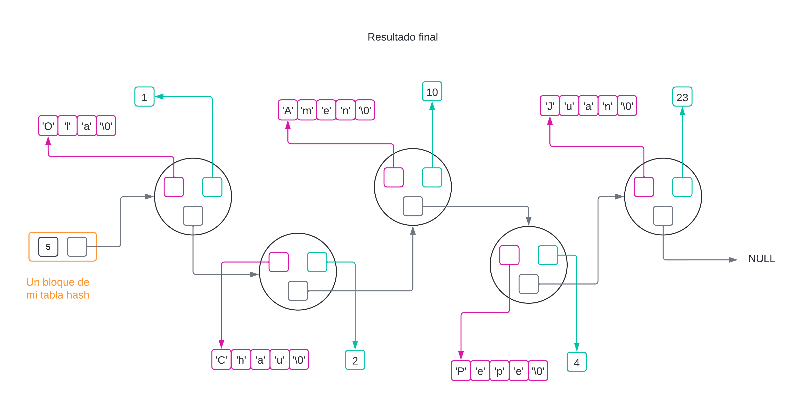
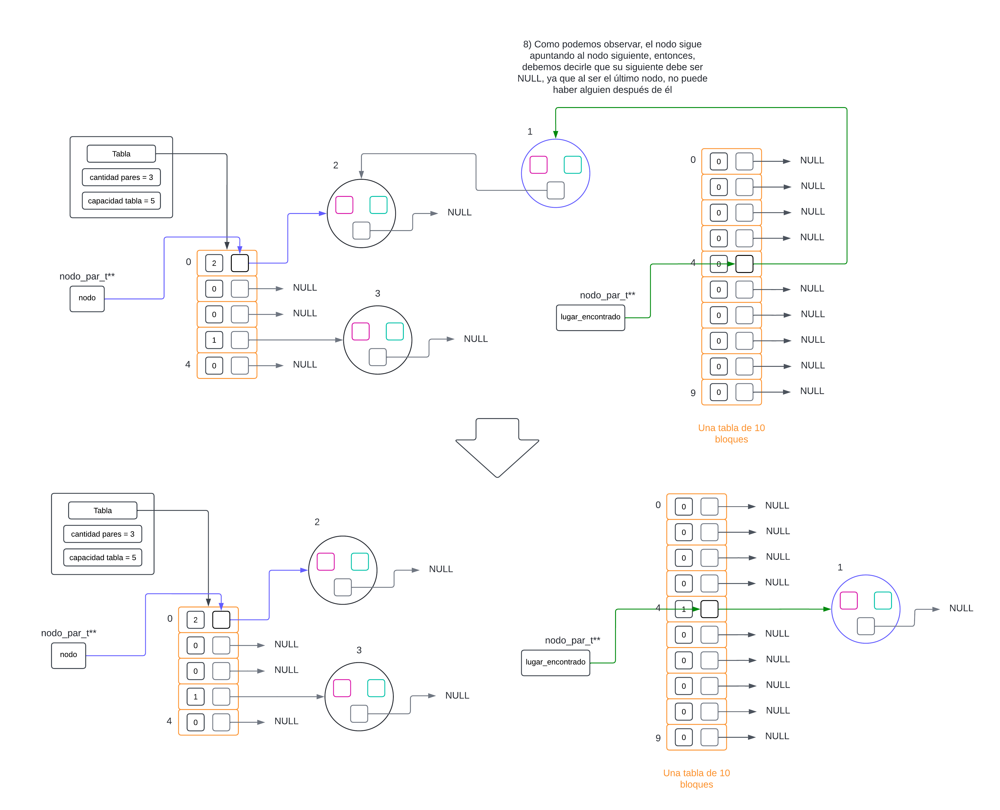

<div align="right">

</div>

# TDA HASH

## Repositorio de (Juan Ernesto Juarez Lezama) - (110418) - (jjuarez@gmail.com)

- Para compilar:

```bash
gcc -g tp_hash.c src/hash.c src/csv.c src/split.c -o tp_hash
```

- Para ejecutar:

```bash
./tp_hash pokedex.csv
```

- Para ejecutar con valgrind:
```bash
valgrind ./tp_hash pokedex.csv
```
---
##  Funcionamiento

- Se creó un programa que lee el archivo `pokedex.csv` y almacena todos lo datos en un diccionario. Así quedaría el Stack y Heap de `tp_hash.c`.

<div align="center">

</div>

- Decidí que la estructura, en vez de ser `struct pokemon` sea `struct info_pokemon`, ya que antes en la estructura se le asignaba el nombre y sus estadisticas, ahora solo guardaré las estadisticas, ya que el nombre es una clave, mejor tenerlo afuera de la estructura.

```c
typedef struct pokemon {
	char tipo;
	int fuerza;
	int destreza;
	int resistencia;
} info_pokemon;
```

# IMPLEMENTACIÓN TDA HASH
Mencioanr que todas las imágenes mostradas están en el Heap.

## ESTRUCTURA
- Para mi implementación decidí utilizar nodos enlazados y no el TDA Lista, debido a que, aunque ambos tiene el concepto de ser nodos enlazados, estaría duplicando la cantidad de memoria que necesitaría. De nada me sirve crear nodos para guardar estructuras `clave - valor`, si mi nodo puede ser esa `clave - valor` y una referencia al siguiente nodo. Otra razón fundamental es, que si mi tabla depende de Listas, si una Lista falla al crearse, todo el hash tendría que detenerse y eso no me conviene al momento de redimensionar.

1) Listas 

<div align="center">

</div>

2) Nodos Enlazados 

<div align="center">

</div>

- Como estructura principal, tendremos un bloque que administra la cantidad de pares totales, la capacidad (tamaño) de mi tabla de hash y para mi caso en particular, decidí que cada bloque del vector contenga un indice de conteo para saber cuántos nodos tenemos enlazados en cada bloque y un puntero al inicio del recorrido de los nodos enlazados (Si no hay ningún nodo en algún bloque, entonces la `cantidad_pares` es `0` y `nodo_inicio` apunta a `NULL` en dicho bloque).

## FUNCION HASH

- La función de hash que elgí es el algoritmo `FNV-1a`  
- Enlace: https://en.wikipedia.org/wiki/Fowler%E2%80%93Noll%E2%80%93Vo_hash_function#FNV-1a_hash
- Lo que hace este algoritmo es tener 2 variables, un número llamado `valor_hash` que es un número base (valor inicial) donde vamos a contener el hasheo final, y otra variable `factor_primo` que, como su nombre indica, es un número primo, esto es así porque se demuestra que los números primos manejan mejor el factor de mezclar las cosas, mejor dicho, el hasheo tiende a ser diferente clave tras clave y eso ayuda a la dispersión de las claves, lo que significa que no habrá tantas colisiones.  
El operador `^=` es un `XOR`. Ya que cada caracter es un valor numerico en la tabla ASCII, cada valor numerico se puede manejar como binario, entonces se aplica `XOR` entre el binario de `valor_hash` y el binario de del ASCII de cada caracter de la clave y luego el valor en decimal se multiplica con el número primo. Y así hasta iterar todos los caracteres de la clave.


## BUSQUEDA DE CLAVES

- Como vamos a trabajar con nodos enlazados, vamos a tener una función recursiva de busqueda para obtener algún nodo, ya sea para elimnar o insertar (todo es buscar).  
- Para poder apuntar a algún nodo, tenemos 2 maneras, haciendo simplemente `nodo_par_t* nodo = nodo_par` aquí estoy apuntando directamente al nodo, por eso es un puntero simple, pero, ¿quién más está apuntando a mi nodo? Claro, el nodo anterior tiene la referencia a mi nodo actual con `->siguiente`. entonces, yo apuntaré a la dirección de memoria de `->siguiente`. Lo que genero con eso es que tengo una manipulación más directa de los nodos que con un nodo simple y minimizando los if (así como tener menos errores).  
- Pasos para la busqueda:  
	1) Le aplico una función de hash a la clave.  
	2) El hasheo lo acomodo entre el intervalo de [0, tamaño del vector], obteniendo la posición de la clave en al tabla hash. Si la variable `posicion` no es NULL (parámetro), entonces le asginaré dicho valor numerico. Eso me servirá afuera de esta función para poder contabilizar la cantidad de nodos enlazados en cada bloque, si es que es una nueva clave.
	3) Por último llamo a la función recursiva `buscar_puntero_a_nodo` que de devuelve el doble puntero. Con esto puedo tener solo 2 opciones, donde `*par` puede apuntar a NULL (el final de todos los nodos) o a una dirección de memoria válida (algún nodo que ya existe la clave).  

- Una vez obtengamos el doble puntero, podemos apreciar que tenemos solo 1 verificación, si `*par` apunta a NULL o no  
- Si apunta a NULL, significa que la clave es nueva, en cambio, si nos hubiese dado una dirección válida, significa que la clave ya se encuentra insertada. Con esto nos ahorramos verificar distintas cosas: Si trabajamos con puntero simple, tendriamos que hacer una validación de si la cantidad de pares en dicho bloque es 0 o no, si es 0, entonces le asigno como primer posicion, y si no, entonces pongo en siguiente del nodo final y también, al trabajar con punteros simple, debemos tener un puntero al nodo anterior, entonces en vez de tener más variables, hice 2 en 1. Visualmente tenemos esto con doble puntero:

1) Ejemplo de como tendriamos los nodos enlazados dentro de un bloque de la tabla hash (El último nodo debe ser la clave "Pepe", como en las siguientes imagenes, se me pasó ver ese error).  
<div align="center">

</div>

2) Insertar un elemento que ya se encuentra en el hash.  
<div align="center">

</div>

3) Insertar un elemento que no está en el hash. 
<div align="center">

</div>

4) Resultado final de los 2 escenarios anteriores.  
<div align="center">

</div>

## REDIMENSION

- Lo que hace el cóðigo es, en primer lugar, crear un nuevo vector con un tamaño duplicado al que ya tenía (`FACTOR_CRECIMIENTO = 2`). Dicha función de redimensión es booleana, porque, en el caso que la creación del vector dé error sin verificación (que la funcion sea un `void`, en vez de un `bool`), significa que no debería ingresar nada al hash. Si yo ignoro esto, y decido insertar pares en mi tabla, aunque haya dado error, significa que no se va a redimensionar pero seguiré metiendo pares, lo que ocacionaria en un ciclo infinito de nunca redimensionar y mi tabla tendrá siempre dicha cantidad de bloques, y muchos pares, lo que se tardaría en poder buscar algún nodo.

- Una vez que creamos la nueva tabla hash, vamos a pasar todos los nodos existentes de mi antigua tabla, a la nueva tabla. Visualmente tenemos esto:  

1) Creación de la tabla.
<div align="center">

</div>

2) Busqueda de la posicion del nodo en la nueva tabla.
<div align="center">

</div>

3) Asignación de punteros del nodo en la nueva tabla.
<div align="center">

</div>

4) Resultado final en un nodo.
<div align="center">

</div>

Mencionar:  
- Cada vez que pasemos nodos de la tabla antigua a la tabla nueva, igual vamos a tener que tener la cantidad de nodos por bloques actualizada, por eso la parte del código de `nueva_tabla_hash[posicion_en_la_tabla].cantidad_pares++`.  
- Por último, una vez que repartimos cada nodo de la antigua tabla a la nueva, podemos liberar la antigua tabla y referenciar la nueva tabla en mi hash. Al igual que mi nueva capacidad.  
- Por último, voy a actualizar mi doble puntero, ya que al ser una nueva tabla, debo buscar la nueva ubicación donde debo insertar o actualizar.  

## ¿CÓMO SABEMOS SI HAY QUE REDIMENSIONAR O NO?
 
Tengo 2 verificaciones para saber si redimensionar o no:  

1) Si la cantidad de nodos es igual o mayor a al 70% de la capacidad total del vector (`FACTOR_PORCENTAJE_CAPACIDAD = 0.70`)  

2) Si llegó a una cantidad máxima de nodos en algún bloque. Con esto ganamos que, en el caso que se dé la mala suerte que un bloque obtenga la mayoria de los pares (por no decir todos), entonces esta verificación nos ayuda que buscar sea O(1), porque como maximo, solo iteraré 10 veces, más de eso, no podré, por eso mando a redimensionar y se vuelvan a distribuir los nodos.  

## Preguntas:

## Qué es un diccionario
Así como en un diccionario tiene palabras y sus definiciones, en el ámbito de la informática, se entiende como diccionario a aquello que existe 1 única clave (palabra) y esa clave tiene asociado un valor (definición) que es el contenido que guarda. Entones se dice que un diccionario es una colección de claves y cada clave única tiene asociado valores. Podemos acceder a los valores únicamente conociendo las claves.

## Qué es una función de hash y qué características debe tener para nuestro problema en particular
Una función de hash se basa es la aplicación de diversos métodos matemáticos (sumar, restar, multiplicar, etc) para poder transformar una entrada (las claves), en alguna salida alfanumerica. Para nuestro caso en particular, solo será una salida numerica. Entonces la función de hash depende tanto del algoritmos matematico, como de la entrada.

## Qué es una tabla de Hash y los diferentes métodos de resolución de colisiones vistos (encadenamiento, probing, etc)
Una tabla de hash, es una tabla (vector) donde cada posición de la tabla está asignado por alguna función de hash, o sea, para ingresar a alguna posición de la tabla, vamos a depender de la transformación numérica (función de hash) de alguna entrada, y como resultado, tendremos alguna posición de la tabla. Va a suceder que 2 o más entradas (claves) puedan tener el mismo resultado de salida (misma posición en la tabla), esto se le conoce como colisiones, aquí algunos métodos de resolución de colisiones.

1) Encadenamiento (Hash abierto)
- Este es el método que nosotros usamos para nuestra implementación de TDA Hash, en cuál consiste en que si 2 o más claves tienen la misma posición den la tabla de hash, van a ir, como el nombre dice, encadenados uno tras otro, en forma de una lista.  
2) Probing lineal (Hash cerrado)  
- Aquí, cuando una clave nueva tiene la misma posición que una clave ya existente, va a avanzar a la siguiente posición de la tabla a ver si el espacio está vacio. Si lo está se inserta ahí, si no lo está, sigue avanzando hasta encontrar donde insertarse.  

<div align="center">

</div>

3) Probing cuadrático (Hash cerrado)  
- Cómo la idea anterior, va a buscar la posición "siguiente", porque, lo que hace el probing cuadrático es ver cuantas veces fallaste, elevarlo al cuadrado y moverte esa canidad de espacios. Ejemplo: La posicion de dicha clave dio 2, en la tabla está ocupado esa posición, entonces tuve 1 intento fallido: 1² = 1, avanzamos 1 posición; dicha posición también esta ocupada, tuvimos entonces 2 intentos fallidos: 2² = 4, avanzamos 4 posiciones; dicha posición también esta ocupada, tuvimos 3 intentos fallidos: 3² = 9, avanzamos 9 posiciones, y así hasta encontrar una posición vacía.  

<div align="center">

</div>

4) Hash doble (Has cerrado)  
- Si el lugar ya está ocupado, le aplica otra función de hash a la clave para poder insertar en la tabla.  

## Explicá 3 formas diferentes de implementar un diccionario (tabla de hash cuenta como 1)
Como sabemos que un Diccionario tiene la definición de guardar información que está asociada a una clave, se pueden implementar de varias maneras:  
1) Tabla Hash  
Esta forma se basa en transformar las claves en información numerica trans alguna formula matematica, y dicho numero (en el intervalo de 0 hasta el tamaño de la tabla), es la posición donde ingresaremos nuestra clave y valor. (Cómo toda mi implementación usé tabla hash, no subo imágenes de qué es, porque ya las subí).    
`Lo bueno`: Tanto las formulas matemáticas, como saber en qué posición está cada par `clave-valor` son instantaneas.  
`Lo malo`: Las claves no van a estar ordenadas, el único 'orden' que seguirán, depende de la función de hashing que le demos.  

2) Nodos Simplemente Enlazados (Parecido a una Lista)  
A diferencia de la tabla hash, aquí debemos iterar todas las claves para verificar si ya existe o si no, y poder agregar o actualizar.  
`Lo bueno`: Podemos hacer que sea ordenado.  
`Lo malo`: Al ser nodos enlazados, para buscar una clave, vamos a tener que iterar, en el peor caso, todos los elementos, entonces esta forma lo convierte en la más lenta de nuestras 3 opciones.  

<div align="center">

</div>

3) Árbol Binario de Busqueda  
Como ya sabemos que un ABB es un metodo de ordenamiento comparativo, podriamos guardar claves y valores.  
`Lo bueno`: Al ser comparativo, tenemos la ventaja de que las claves van a estar ordenadas.  
`Lo malo`: Al ser de busqueda, no va a ser rápido como con una tabla hash, pero es más rapido que usando una lista.  

<div align="center">

</div>

## Explique por qué es importante el tamaño de la tabla (tanto para tablas abiertas como cerradas)
Para un Hash Cerrado, sabiendo que en cada bloque de mi tabla se va a almacenar una clave y valor, es esencial aumentar el tamaño, porque si no aumento el tamaño de mi tabla, no voy a poder seguir ingresando nuevos pares, entonces el tamaño sí importa.

Para un Hash Abierto sabemos que podemos encadenar colisiones sin importa el tamaño de la tabla, ya que, si tenemos una tabla de 3 bloques, el problema es que si solo dependemos de esa cantidad de bloques, la busqueda de las clave se hace más compleja, porque vamos a tardanos más en encontrarla. Por esa razón es importante la redimensión de la tabla en un Hash Abierto, para así poder tener la menor cantidad de claves encadenadas en cada bloque y la busqueda sea rápida.

<div align="center">

</div>